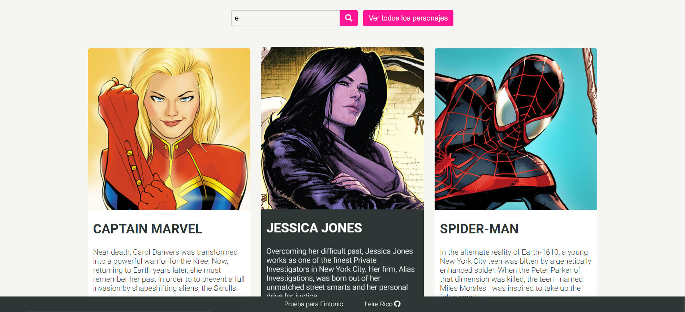

# Welcome to this MARVEL CHARACTERS SEARCHER!!



## 🤖 What is this APP for...
This is a SPA created with **React JS** to search characters from [Marvel API](https://developer.marvel.com/). You can also see the detail of the character selected.

## 👀 Before starting
Because the API was down during the days I did this project, I decided to mock a json with some characters, which is now located in this repository (src/services). Sorry if the data isn't real! 🙈

## 🏗 Getting Started
Install [Node.js](https://nodejs.org/), and then:
1. `$ git clone https://github.com/leireriel/marvel-searcher-react.git` to clone the repository
2. `$ npm install` to install dependencies 
3. `$ npm start` to run the project in your browser 

## 🖇 Structure
```
|_src
  |_App

  |_services
    |_fetchCharacters
    |_mockCharacters.json

  |_components
    |_FetchCharacters
    |_Filters
      |_FilteredCharacter
    |_Search
    |_CharacterList
    |_CharacterDetail
      |_NavDetail
      |_PaintDetail
    |_Contact
  
  |_styles
    |_core
      |_variables
      |_mixins

  |_images
```

## 💪 Challenges
This project has been created during three days in which I have learned many things.
I was used to using a global state, but this week I learned that in some cases it may be better to control the **states in each component**.

In this project there are **two routes**:
1. One as the home route (that contains the list of characters)
2. And the detail route (created with the id of the character when the user clicks on it).

Since both routes contain components that make a different fetch, it was not neccesary to store the array of characters in the global state (as I was used to).

It was a challenge for me to make requests to an API using **authentication** (although later I could not use it). I've also made a **mock** and **fetch to a local json** for the first time.

## 🗂 Dependencies
* [react](https://www.npmjs.com/package/react) - Framework of the project ⚛ 
* [react-router-dom](https://www.npmjs.com/package/react-router-dom) - For routing :)
* [prop-types](https://www.npmjs.com/package/prop-types) - A way to dynamically verify the props of our components
* [node-sass](https://www.npmjs.com/package/node-sass) - For the use of SCSS in the project

## 👩🏼‍💻 Technologies
API
* [Postman](https://www.getpostman.com/) to make petitions to API

Programming (JS / React)
* Use of some **React component lifecycle** methods
* Use of **React Router** to simulate pages
* Use of **React PropTypes**

Layout
* **SASS**
* **Variables, mixins, animations and transitions**
* **Responsive** design 
* **Mobile First**
* **Flexbox**
* Use of **BEM** for class naming

## 💡 To Do
* **Better control the rendering**. Render the list of characters in CharacterList component only when the button is clicked. I think I'm having some kind of *asynchrony* with the state when clicking the button (double answer receipt). shouldComponentUpdate should work, but I think it's making a delay because of this docuble answer.
* Make it possible to **click the "Ver todos los personajes" button in first place**. It only works if we have clicked first the small one.
* Improve **organization of components** for first route (includes components FetchCharacters, FilteredCharacter, Search and CharacterList). Maybe this components should be organized in hierarchy, instead of in the same level. I need to document about strategies to organize components.
* Real **fetch to Marvel API**.
* **Horizontal scroll** to see the characters in the list component.

## 👨‍🏫 Attribution
1. Images of characters are from [Marvel website](https://www.marvel.com/explore).
2. Favicon got in [IconArchive](http://www.iconarchive.com/show/ultrabuuf-icons-by-mattahan/Comics-Spiderwoman-icon.html).

# 🤜🤛 Contributing
All suggestions are welcome, please open an issue.
Thank you 💜

## 🙏🏿 Acknowledgments 
Thank you Matías for giving me a fun exercise. Although I went crazy when the api was not working, I learned a lot doing the test! 🤯

And thanks everyone for reading! :)
